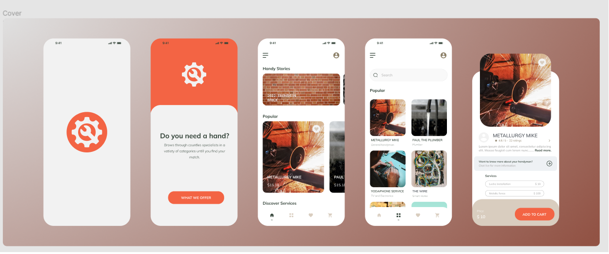

# Need A HandyMan?

This project is built with React Native with the help of expo's CLI which made things alot easier, so this app is a handyman finder where it connects users and handymen in your local area. Whose design was taken from one of the free mobile designs down there in Figma which I'm super thankful for I'll try to leave the link to the creator/project below. It's still under construction but you can see some of the screens from the screenshot. Here's the link for the figma design: [Figma Design Page](<https://www.figma.com/file/BPTYdL6YoI4tHqYrbInynZ/Need-a-hand%3F-(Community)?node-id=157%3A836>).

### Some of it's features you ask?:blush:

- Tab Navigation as well as Drawer Navigation.
- Home page has multiple scroll view which line up vertically.
- Few screens include Discovery, Popular, Fav and Cart.

# Screenshots

### Figma Cover

